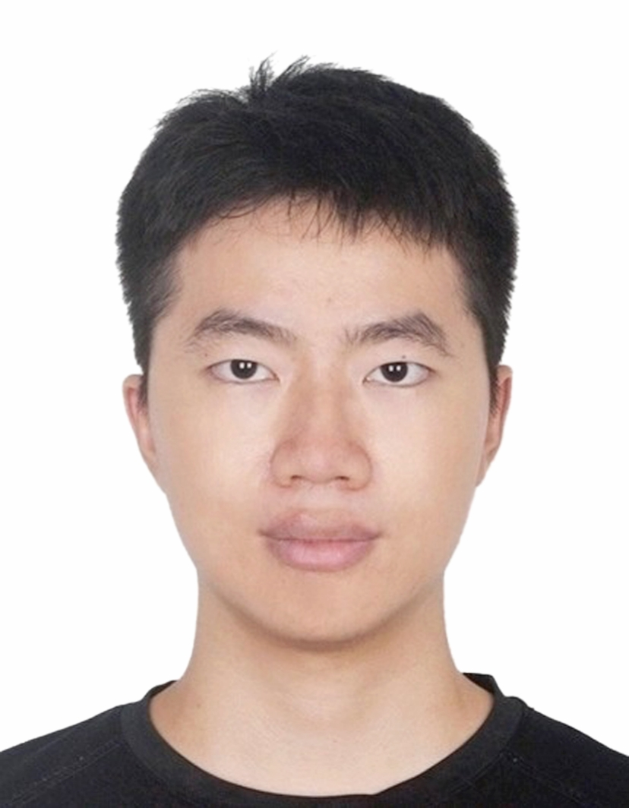

### Hi there 👋

<!--
**j-cyoung/j-cyoung** is a ✨ _special_ ✨ repository because its `README.md` (this file) appears on your GitHub profile.

Here are some ideas to get you started:

- 🔭 I’m currently working on ...
- 🌱 I’m currently learning ...
- 👯 I’m looking to collaborate on ...
- 🤔 I’m looking for help with ...
- 💬 Ask me about ...
- 📫 How to reach me: ...
- 😄 Pronouns: ...
- ⚡ Fun fact: ...
-->

# 👋 Hi, I'm Chenyang Jiang

I'm a doctoral candidate at Harbin Institute of Technology, Shenzhen, advised by Professor Jingyong Su.  
I received my B.S. degree in Computer Science and Technology at HIT Shenzhen in 2023.  

My research focuses on **data-centric AI**, particularly **dataset distillation**.

[2025-09-20]() My recent paper *"Rectifying Soft-Label Entangled Bias in Long-Tailed Dataset Distillation"* has been accepted at **NeurIPS 2025**.

